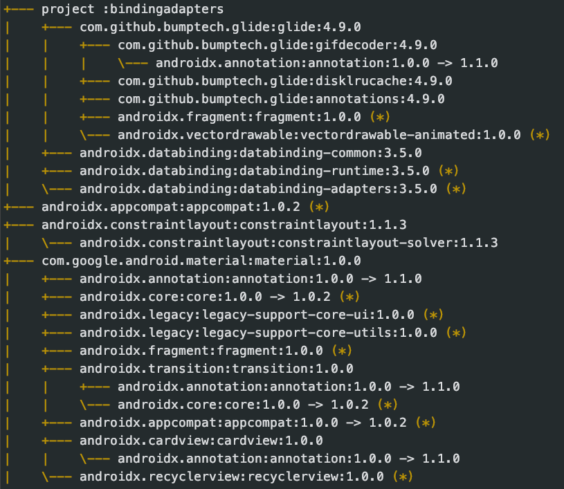
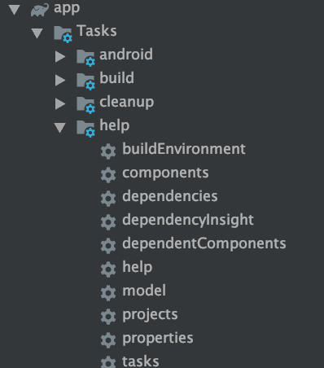

### 查看依赖信息

1. 命令行方式

   ```
   ➜  MyProject git:(develop) ./gradlew :app:dependencies > ./dependen.txt
   ```
   
2. 鼠标操作




3. 浏览器查看

   ```
   /gradlew build --scan
   出现提示
   Publishing a build scan to scans.gradle.com requires accepting the Terms of Service defined at https://scans.gradle.com/terms-of-service. Do you accept these terms? [yes, no]
   输入yes ，打开链接即可
   Gradle Terms of Service accepted.
   
   Publishing build scan...
   https://gradle.com/s/x x x x x x
   ```

4. 使用Gradle View插件

   

### 解决依赖冲突

1. so依赖冲突，使用pickFirst
2. jar版本冲突，一个项目的多个模块对同一模块的不同版本不同版本有依赖
   [Gradle依赖项学习总结，dependencies、transitive、force、exclude的使用与依赖冲突解决](http://www.paincker.com/gradle-dependencies)

