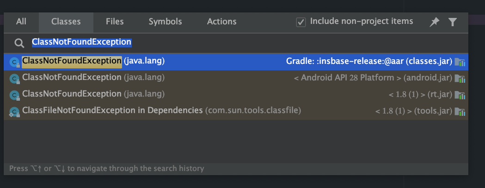
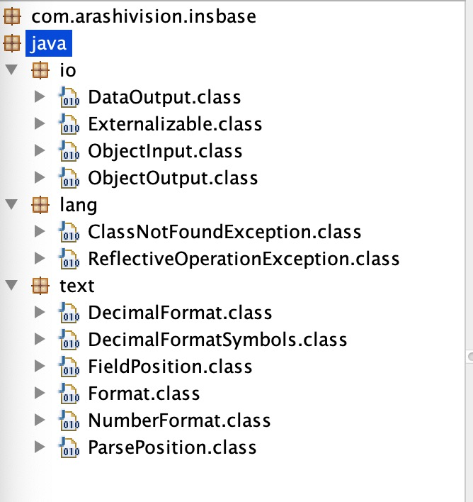

最近项目中引入了第三方aar包后打release包失败，以及升级到v8a后缺少了v7a中的一些so包不知道具体是哪些依赖引入的，不知道作用是什么，于是顺带研究一下Android的打包流程。


### 一、打release包时报错

可以打debug包，但是打release时总是失败。

```
./gradlew assembleRelease --scan 
```

失败时在最后合成jar包的时候报错了，具体是transformClassesWithDexForXxxappRelease这一步，这里报的错误一开始多种多样，最后发现以下的错误出现得比较多。

```java
trouble processing "java/lang/ClassNotFoundException.class":
Ill-advised or mistaken usage of a core class (java.* or javax.*)
when not building a core library.
This is often due to inadvertently including a core library file
in your application's project, when using an IDE (such as
Eclipse). If you are sure you're not intentionally defining a
core class, then this is the most likely explanation of what's
going on.
However, you might actually be trying to define a class in a core
namespace, the source of which you may have taken, for example,
from a non-Android virtual machine project. This will most
assuredly not work. At a minimum, it jeopardizes the
compatibility of your app with future versions of the platform.
It is also often of questionable legality.
If you really intend to build a core library -- which is only
appropriate as part of creating a full virtual machine
distribution, as opposed to compiling an application -- then use
the "--core-library" option to suppress this error message.
If you go ahead and use "--core-library" but are in fact
building an application, then be forewarned that your application
will still fail to build or run, at some point. Please be
prepared for angry customers who find, for example, that your
application ceases to function once they upgrade their operating
system. You will be to blame for this problem.
If you are legitimately using some code that happens to be in a
core package, then the easiest safe alternative you have is to
repackage that code. That is, move the classes in question into
your own package namespace. This means that they will never be in
conflict with core system classes. JarJar is a tool that may help
you in this endeavor. If you find that you cannot do this, then
that is an indication that the path you are on will ultimately
lead to pain, suffering, grief, and lamentation.
1 error; aborting
:xxxapp:transformClassesWithDexForXxxappRelease (Thread[Daemon worker Thread 4,5,main]) completed. Took 6.777 secs.

FAILURE: Build failed with an exception.

* What went wrong:
Execution failed for task ':Xxxapp:transformClassesWithDexForXxxappRelease'.
> com.android.build.api.transform.TransformException: com.android.idception: java.util.concurrent.ExecutionException: com.android.ide.common.process.ProcessException: Return code 1 for dex process

* Try:
Run with --stacktrace option to get the stack trace. Run with --debug option to get more log output. Run with --scan to get full insights.

* Get more help at https://help.gradle.org

BUILD FAILED in 5m 11s
319 actionable tasks: 30 executed, 289 up-to-date
Build cache (/Users/ldh/.gradle/caches/build-cache-1) has not been cleaned up in 0 dayse.common.process.ProcessEx
```

分析上面的日志，提示覆写了java的一些核心类，于是报了以上的错误，具体的类有时候报"java/io/Externalizable.class"，有时候报trouble processing "java/lang/ClassNotFoundException.class"。

问题是怎么确定是aar覆写了这些jdk的核心类，一般不会有程序员做这种事吧～～

忽然想到可以在AS中连续两次按下command+O，应该可以搜索到SDK中的类。

这一下问题清晰了，找到这个aar，改后缀为zip，解压之后获取到classes.jar文件，扔到jd-gui里面，找到了这些被覆盖的类，于是发给类SDK提供方要求检查一下为啥打入了java的核心类。




### 二、查找缺少的依赖包

同一份代码打了v7a和v8a的包，比对两边之后发现v8a中缺少了7个.so文件，可是这7个so具体做什么用的呢？应用面临着不定什么功能会崩的风险，就算可以全面的回归测试，既不现实，也无济于事。

没有什么头绪，Android studio不支持搜索依赖中的字符串，想到了可以通过反编译apk的代码，拿到jar文件之后通过jd-gui去查找这些.so的文件名，看看具体是在代码的什么部分引用的，可是查询这些文件名全部没有。。。。如果通过文件名去加载字符串，按理来说应该是可以搜索到的。没有查到难道说明这些.so是通过cmake的方式引用的？

咨询了一圈同事，也是说没有什么好的办法，就是说下载下来所有的依赖文件，一个个解压去查找。正好老大指出了其中一个so时全景相机sdk的文件，于是去下载了这个aar文件展开，比照了一下，居然这7个so全部都在其中。

然后去向sdk提供方申请了arm64-v8a的文件替换了一下，代码可以正常运行了。

从其中一个明显的线索出发，所有的问题竟然全部迎刃而解。有时候同时遇到的多个问题，其实只是一个问题。