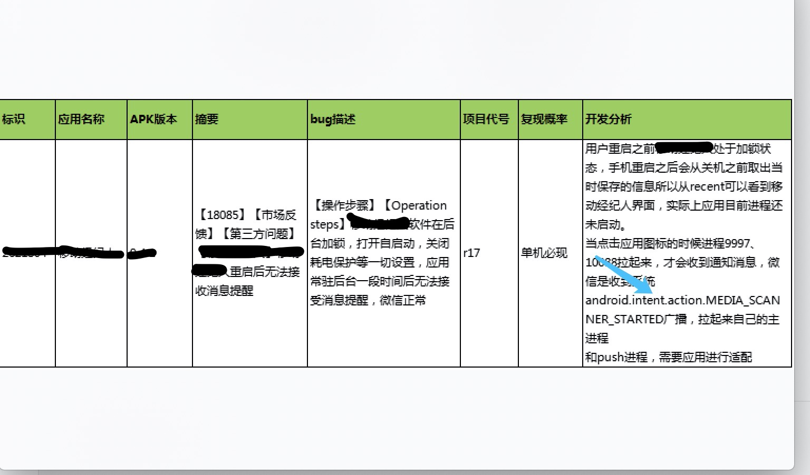

### Android app的自启动与进程保活

#### 一、Android 8.0以后的静态注册广播限制及开机广播

由一个线上问题说起：



[Android隐式广播例外情况](https://developer.android.google.cn/guide/components/broadcast-exceptions)

其实MEDIA_SCANNER_STARTED广播不属于上述例外情况，在8.0以上的机器上仍可以静态注册，但是OPPO手机上无法开机自启动。（也无法当app进程处于最近进程列表但被后台清理的场景下，接收广播并拉起进程？）

1. 通常属于例外情况支持静态注册的隐式广播也需要app进程存活才可以接收广播（有前台服务也行）。
2. 开机启动相当于进程在后台被杀死仍在最近的进程列表中的场景，手动杀死进程无法接受任何隐式广播。
3. BOOT_COMPLETED广播支持静态注册与开机自启动，需要app申请权限`<uses-permission android:name="android.permission.RECEIVE_BOOT_COMPLETED" />`。
4. MIDIA相关的广播支持静态注册，需要在`<IntetFilter>`标签中添加`<data android:scheme="file" />`。
5. ACTION_MEDIA_MOUNTED广播支持静态注册，在oppo与华为手机上均支持开机自启动。
6. MEDIA_SCANNER_STARTED，MEDIA_SCANNER_FINISHED广播支持静态注册，在oppo r17手机上不支持开机拉起进程，华为手机上可以（估计和开机广播先后顺序有关，华为手机有扩展SD卡，这个广播发送多次比较晚），推测不支持OPPO开机自启动，但对进程保活有帮助，因为这个广播会在手机不关机的情况下多次发送。
7. 无论BOOT_COMPLETED还是ACTION_MEDIA_MOUNTED，当且仅当用户允许开机自启动，且应用在最近的进程列表中（估计判断为前台进程了），可以开机拉起进程。

> https://developer.android.google.cn/guide/components/broadcasts
> Android 8.0
>
> 从 Android 8.0（API 级别 26）开始，系统对清单声明的接收器施加了额外的限制。
>
> 如果您的应用以 Android 8.0 或更高版本为目标平台，那么对于大多数隐式广播（没有明确针对您的应用的广播），您不能使用清单来声明接收器。当用户正在活跃地使用您的应用时，您仍可使用[上下文注册的接收器](https://developer.android.google.cn/guide/components/broadcasts#context-registered-recievers)。
#### 二、OPPO R17—8.1系统开机启动时发出的系统广播

>如何查看Android系统当前发送了什么广播
> `dumpsys |grep BroadcastRecord`
>从上到下，是按照从新到旧的顺序排列的，也就是说第一行是系统最新发出的一个广播。

其中有BOOT_COMPLETED与MEDIA_MOUNTED广播，可以静态注册拉起进程，也有MEDIA_SCANNER_STARTED支持静态注册，但是无法拉起进程。

```java
130|PBEM00:/ $ dumpsys | grep BroadcastRecord                                              
    BroadcastRecord{f405b9 u-1 android.intent.action.TIME_TICK} to user -1
    BroadcastRecord{c18f44f u-1 android.media.RINGER_MODE_CHANGED} to user -1
    BroadcastRecord{df9e80c u-1 android.media.RINGER_MODE_CHANGED} to user -1
    BroadcastRecord{d63a555 u-1 android.media.ACTION_SCO_AUDIO_STATE_UPDATED} to user -1
    BroadcastRecord{48b7b6a u-1 android.media.ACTION_SCO_AUDIO_STATE_UPDATED} to user -1
    BroadcastRecord{6e4edb u-1 android.hardware.usb.action.USB_STATE} to user -1
    BroadcastRecord{cfa085b u-1 android.hardware.usb.action.USB_STATE} to user -1
    BroadcastRecord{e29db56 u-1 android.hardware.usb.action.USB_STATE} to user -1
    BroadcastRecord{66378f8 u-1 android.hardware.usb.action.USB_STATE} to user -1
    BroadcastRecord{fd67acd u-1 android.hardware.usb.action.USB_STATE} to user -1
    BroadcastRecord{f0641d1 u-1 android.hardware.usb.action.USB_STATE} to user -1
    BroadcastRecord{987c4c2 u-1 android.hardware.usb.action.USB_STATE} to user -1
    BroadcastRecord{65de436 u-1 android.hardware.usb.action.USB_STATE} to user -1
    BroadcastRecord{923cbe5 u-1 android.hardware.usb.action.USB_STATE} to user -1
    BroadcastRecord{946cf37 u-1 android.hardware.usb.action.USB_STATE} to user -1
    BroadcastRecord{4eb8742 u-1 android.hardware.usb.action.USB_STATE} to user -1
    BroadcastRecord{75b44ea u-1 android.hardware.usb.action.USB_STATE} to user -1
    BroadcastRecord{1d32ca4 u-1 android.hardware.usb.action.USB_STATE} to user -1
    BroadcastRecord{95c2a0d u-1 android.hardware.usb.action.USB_STATE} to user -1
    BroadcastRecord{41c0dc2 u-1 android.hardware.usb.action.USB_PORT_CHANGED} to user -1
    BroadcastRecord{22f27d3 u-1 android.hardware.usb.action.USB_STATE} to user -1
    BroadcastRecord{c686f10 u-1 android.hardware.usb.action.USB_PORT_CHANGED} to user -1
    BroadcastRecord{8f260f3 u-1 android.intent.action.TIME_TICK} to user -1
    BroadcastRecord{ae5a09 u-1 android.media.ACTION_SCO_AUDIO_STATE_UPDATED} to user -1
    BroadcastRecord{5a1440e u-1 android.media.SCO_AUDIO_STATE_CHANGED} to user -1
    BroadcastRecord{93a6e2f u-1 android.intent.action.CONFIGURATION_CHANGED} to user -1
    BroadcastRecord{2cd6c3c u-1 android.intent.action.CONFIGURATION_CHANGED} to user -1
    BroadcastRecord{1e3a0d8 u-1 android.bluetooth.adapter.action.STATE_CHANGED} to user -1
    BroadcastRecord{ad98dc5 u-1 android.bluetooth.adapter.action.STATE_CHANGED} to user -1
    BroadcastRecord{331931a u0 android.intent.action.USER_UNLOCKED} to user 0
    BroadcastRecord{ee4099a u-1 android.bluetooth.adapter.action.STATE_CHANGED} to user -1
    BroadcastRecord{709be4b u-1 android.bluetooth.adapter.action.STATE_CHANGED} to user -1
    BroadcastRecord{231028 u-1 android.hardware.usb.action.USB_STATE} to user -1
    BroadcastRecord{4ca4141 u-1 android.hardware.usb.action.USB_STATE} to user -1
    BroadcastRecord{345c6e6 u-1 android.media.RINGER_MODE_CHANGED} to user -1
    BroadcastRecord{333f427 u-1 android.media.VOLUME_CHANGED_ACTION} to user -1
    BroadcastRecord{ead06d4 u-1 android.media.VOLUME_CHANGED_ACTION} to user -1
    BroadcastRecord{3b8b07d u-1 android.media.VOLUME_CHANGED_ACTION} to user -1
    BroadcastRecord{9176b72 u-1 android.media.VOLUME_CHANGED_ACTION} to user -1
    BroadcastRecord{de1abc3 u-1 android.media.VOLUME_CHANGED_ACTION} to user -1
    BroadcastRecord{73dbc40 u-1 android.media.VOLUME_CHANGED_ACTION} to user -1
    BroadcastRecord{e24d779 u-1 android.media.VOLUME_CHANGED_ACTION} to user -1
    BroadcastRecord{fecccbe u-1 android.media.VOLUME_CHANGED_ACTION} to user -1
    BroadcastRecord{729411f u-1 android.media.VOLUME_CHANGED_ACTION} to user -1
    BroadcastRecord{b625c6c u-1 android.media.VOLUME_CHANGED_ACTION} to user -1
    BroadcastRecord{8927235 u-1 android.media.VOLUME_CHANGED_ACTION} to user -1
    BroadcastRecord{f24f6ca u-1 android.media.VOLUME_CHANGED_ACTION} to user -1
    BroadcastRecord{2ad03b u-1 android.media.INTERNAL_RINGER_MODE_CHANGED_ACTION} to user -1
    BroadcastRecord{64ed358 u-1 android.media.RINGER_MODE_CHANGED} to user -1
    BroadcastRecord{204fcb1 u-1 android.intent.action.USER_SWITCHED} to user -1
    BroadcastRecord{b63da8 u-1 android.net.wifi.RSSI_CHANGED} to user -1
    BroadcastRecord{c51a0c1 u-1 android.net.wifi.RSSI_CHANGED} to user -1
    BroadcastRecord{c8530be u-1 android.net.wifi.RSSI_CHANGED} to user -1
    BroadcastRecord{a83d51f u-1 android.net.wifi.RSSI_CHANGED} to user -1
    BroadcastRecord{a0b606c u0 android.intent.action.DROPBOX_ENTRY_ADDED} to user 0
    BroadcastRecord{dc12635 u0 android.intent.action.DROPBOX_ENTRY_ADDED} to user 0
    BroadcastRecord{6df9aca u0 android.intent.action.DROPBOX_ENTRY_ADDED} to user 0
    BroadcastRecord{9aa43b u0 android.intent.action.DROPBOX_ENTRY_ADDED} to user 0
    BroadcastRecord{841758 u0 android.intent.action.DROPBOX_ENTRY_ADDED} to user 0
    BroadcastRecord{d6af0b1 u0 android.intent.action.DROPBOX_ENTRY_ADDED} to user 0
    BroadcastRecord{5c49996 u0 android.intent.action.DROPBOX_ENTRY_ADDED} to user 0
    BroadcastRecord{b854917 u0 android.intent.action.DROPBOX_ENTRY_ADDED} to user 0
    BroadcastRecord{2cf5104 u0 android.intent.action.DROPBOX_ENTRY_ADDED} to user 0
    BroadcastRecord{a0ce6ed u0 android.intent.action.DROPBOX_ENTRY_ADDED} to user 0
    BroadcastRecord{52a47dc u0 com.oppo.intent.action.KEY_LOCK_MODE} to user 0
    BroadcastRecord{50dd0e5 u-1 android.net.wifi.RSSI_CHANGED} to user -1
    BroadcastRecord{2a5e7ba u-1 android.net.wifi.RSSI_CHANGED} to user -1
    BroadcastRecord{11a866b u-1 android.net.wifi.RSSI_CHANGED} to user -1
    BroadcastRecord{f0205c8 u-1 android.net.wifi.RSSI_CHANGED} to user -1
    BroadcastRecord{24f9661 u-1 com.android.server.action.NETWORK_STATS_UPDATED} to user -1
    BroadcastRecord{bbac586 u-1 android.intent.action.BATTERY_CHANGED} to user -1
    BroadcastRecord{2591e47 u0 com.oppo.intent.action.KEY_LOCK_MODE} to user 0
    BroadcastRecord{915b674 u-1 android.net.wifi.STATE_CHANGE} to user -1
    BroadcastRecord{d8e379d u-1 android.net.conn.CONNECTIVITY_CHANGE} to user -1
    BroadcastRecord{89cd04 u0 com.oppo.intent.action.KEY_LOCK_MODE} to user 0
    BroadcastRecord{c3bb2ed u-1 android.net.wifi.RSSI_CHANGED} to user -1
    BroadcastRecord{63d9522 u0 com.oppo.intent.action.KEY_LOCK_MODE} to user 0
    BroadcastRecord{5f50bb3 u-1 android.net.conn.CONNECTIVITY_CHANGE} to user -1
    BroadcastRecord{258b570 u-1 android.net.conn.CONNECTIVITY_CHANGE} to user -1
    BroadcastRecord{bad90e9 u-1 android.net.wifi.STATE_CHANGE} to user -1
    BroadcastRecord{843e16e u-1 android.net.conn.CONNECTIVITY_CHANGE} to user -1
    BroadcastRecord{caab00f u0 android.intent.action.PACKAGE_CHANGED} to user 0
    BroadcastRecord{b4552a5 u-1 android.net.wifi.SCAN_RESULTS} to user -1
    BroadcastRecord{784bacc u0 oppo.intent.action.BOOT_COMPLETED} to user 0   ====>开机启动完成
    BroadcastRecord{c50a67a u0 com.oppo.intent.action.KEY_LOCK_MODE} to user 0
    BroadcastRecord{d6c3e2b u0 com.oppo.intent.action.KEY_LOCK_MODE} to user 0
    BroadcastRecord{249c288 u0 com.oppo.intent.action.KEY_LOCK_MODE} to user 0
    BroadcastRecord{fdd7421 u0 com.oppo.intent.action.KEY_LOCK_MODE} to user 0
    BroadcastRecord{d32b046 u-1 android.net.conn.CONNECTIVITY_CHANGE} to user -1
    BroadcastRecord{c6e9207 u0 org.codeaurora.poweroffalarm.action.CANCEL_ALARM} to user 0
    BroadcastRecord{3fc7f34 u0 org.codeaurora.poweroffalarm.action.CANCEL_ALARM} to user 0
    BroadcastRecord{77c315d u0 org.codeaurora.poweroffalarm.action.CANCEL_ALARM} to user 0
    BroadcastRecord{1d98ad2 u0 android.bluetooth.adapter.action.SCAN_MODE_CHANGED} to user 0
    BroadcastRecord{25847a3 u0 android.intent.action.DROPBOX_ENTRY_ADDED} to user 0
    BroadcastRecord{7c5aa0 u0 android.intent.action.DROPBOX_ENTRY_ADDED} to user 0
    BroadcastRecord{4f8659 u0 android.intent.action.DROPBOX_ENTRY_ADDED} to user 0
    BroadcastRecord{ea1821e u0 android.intent.action.DROPBOX_ENTRY_ADDED} to user 0
    BroadcastRecord{19dbaff u0 android.intent.action.DROPBOX_ENTRY_ADDED} to user 0
    BroadcastRecord{43f28d2 u-1 android.intent.action.ACTION_POWER_CONNECTED} to user -1
    BroadcastRecord{f5c80cc u0 com.oppo.intent.action.KEY_LOCK_MODE} to user 0
    BroadcastRecord{b6ea49a u0 null} to user 0
    BroadcastRecord{e28b922 u0 com.google.android.checkin.CHECKIN_COMPLETE} to user 0
    BroadcastRecord{20b5fb3 u0 com.google.android.gms.gcm.ACTION_SCHEDULE} to user 0
    BroadcastRecord{aedb412 u0 android.intent.action.MEDIA_SCANNER_FINISHED} to user 0
    BroadcastRecord{1736067 u0 com.coloros.pictorial.upload_favor_pulse} to user 0
    BroadcastRecord{bff57e3 u0 com.google.android.gms.gcm.ACTION_SCHEDULE} to user 0
    BroadcastRecord{511c5e0 u0 com.google.android.gms.gcm.ACTION_SCHEDULE} to user 0
    BroadcastRecord{e1bb099 u0 com.google.android.gms.gcm.ACTION_SCHEDULE} to user 0
    BroadcastRecord{d9b2ef1 u0 sogou.action.send.hmt.contact.data} to user 0
    BroadcastRecord{eeff5e u0 sogou.action.upgrade.hotdict} to user 0
    BroadcastRecord{8458f3f u0 com.google.android.gms.gcm.ACTION_SCHEDULE} to user 0
    BroadcastRecord{fd600c u0 android.intent.action.MEDIA_SCANNER_STARTED} to user 0  
    BroadcastRecord{46dbd55 u0 android.intent.action.MEDIA_SCANNER_FINISHED} to user 0
    BroadcastRecord{727b36a u0 android.intent.action.MEDIA_SCANNER_STARTED} to user 0 
    BroadcastRecord{28de05b u0 android.intent.action.MEDIA_SCANNER_FINISHED} to user 0
    BroadcastRecord{14c2e0b u0 com.google.android.gms.gcm.ACTION_SCHEDULE} to user 0
    BroadcastRecord{af924e8 u0 com.google.android.gms.gcm.ACTION_SCHEDULE} to user 0
    BroadcastRecord{8c39701 u0 com.google.android.gms.gcm.ACTION_SCHEDULE} to user 0
    BroadcastRecord{f0fc9a6 u0 com.google.android.gms.gcm.ACTION_SCHEDULE} to user 0
    BroadcastRecord{58d9fe7 u0 com.google.android.gms.gcm.ACTION_SCHEDULE} to user 0
    BroadcastRecord{7afa794 u0 com.google.android.gms.gcm.ACTION_SCHEDULE} to user 0
    BroadcastRecord{b51a23d u0 com.google.android.gms.gcm.ACTION_SCHEDULE} to user 0
    BroadcastRecord{95eda32 u0 com.google.android.checkin.CHECKIN_COMPLETE} to user 0
    BroadcastRecord{88a5383 u0 com.google.android.gms.gcm.ACTION_SCHEDULE} to user 0
    BroadcastRecord{2a9a900 u0 android.intent.action.MEDIA_SCANNER_STARTED} to user 0
    BroadcastRecord{9bb2539 u0 android.intent.action.MEDIA_SCANNER_FINISHED} to user 0
    BroadcastRecord{d1c677e u0 android.intent.action.MEDIA_SCANNER_STARTED} to user 0 ===>扫描sd卡
    BroadcastRecord{614a4df u0 com.google.android.gms.gcm.ACTION_SCHEDULE} to user 0
    BroadcastRecord{480552c u0 android.intent.action.MEDIA_SCANNER_FINISHED} to user 0
    BroadcastRecord{9fdbf5 u0 com.google.android.gms.gcm.ACTION_SCHEDULE} to user 0
    BroadcastRecord{d937d8a u0 com.google.android.gms.gcm.ACTION_SCHEDULE} to user 0
    BroadcastRecord{ac8affb u0 com.google.android.gms.gcm.ACTION_SCHEDULE} to user 0
    BroadcastRecord{4339818 u0 oppo.intent.action.WIFI_DETECT_RESULT} to user 0
    BroadcastRecord{cdf4271 u0 com.tencent.mm.plugin.report.service.KVCommCrossProcessReceiver} to user 0
    BroadcastRecord{5b3e856 u0 com.google.android.gms.gcm.ACTION_SCHEDULE} to user 0
    BroadcastRecord{6e850d7 u0 com.google.android.gms.gcm.ACTION_SCHEDULE} to user 0
    BroadcastRecord{dcd77bc u0 com.tencent.mm.TrafficStatsReceiver} to user 0
    BroadcastRecord{a4d77af u0 com.google.android.intent.action.GCM_RECONNECT} to user 0
    BroadcastRecord{6d61dc4 u0 com.oppo.weather.action.updatecomplete} to user 0
    BroadcastRecord{fd494ad u0 com.oppo.weather.action.updatecomplete} to user 0
    BroadcastRecord{d9e33e2 u0 com.oppo.weather.action.deal_location} to user 0
    BroadcastRecord{2f72373 u0 com.google.android.gms.gcm.ACTION_SCHEDULE} to user 0
    BroadcastRecord{df95230 u0 com.google.android.gms.gcm.ACTION_SCHEDULE} to user 0
    BroadcastRecord{b52cea9 u0 com.google.android.gms.gcm.ACTION_SCHEDULE} to user 0
    BroadcastRecord{cefac2e u0 com.oppo.querySimCard} to user 0
    BroadcastRecord{21683cf u0 com.google.android.gms.gcm.ACTION_SCHEDULE} to user 0
    BroadcastRecord{d9615c u0 com.google.android.gms.gcm.ACTION_SCHEDULE} to user 0
    BroadcastRecord{160ac65 u0 com.google.android.gms.gcm.ACTION_SCHEDULE} to user 0
    BroadcastRecord{5ce5d3a u0 com.google.android.gms.gcm.ACTION_SCHEDULE} to user 0
    BroadcastRecord{e218deb u0 com.google.android.gms.gcm.ACTION_SCHEDULE} to user 0
```

#### 三、app开机启动实现

1. 用户需要开启自启动，并且上次关闭手机时，app在最近启动应用的进程列表中

2. 在**AndroidManifest**中添加权限，并静态注册

```xml
    <uses-permission android:name="android.permission.RECEIVE_BOOT_COMPLETED" />

        <receiver
            android:name=".recerver.MediaScannerStartedReceiver"
            android:enabled="true"
            android:exported="true">
            <intent-filter>
                <action android:name="android.intent.action.BOOT_COMPLETED" />

                <category android:name="android.intent.category.DEFAULT" />
            </intent-filter>
          </receiver>
    
```

3. 在广播的onReceive方法中开启前台服务，拉起进程
```java
    @RequiresApi(api = Build.VERSION_CODES.O)
    @Override
    public void onReceive(Context context, Intent intent) {
        Toast.makeText(context, "收到广播" + intent.getAction(), Toast.LENGTH_LONG).show();
        Log.d(TAG, "onReceive() called with: context = [" + context + "], intent = [" + intent + "]");
        Intent intent1 = new Intent(context, MyPushService.class);
        context.startForegroundService(intent1);
    }

```

#### 四、app进程保活

推荐使用前台服务

> 对于需要立即运行并且必须执行完毕的由用户发起的工作，请使用[前台服务](https://developer.android.google.cn/guide/components/services)。使用前台服务可告知系统应用正在执行重要任务，不应被终止。前台服务通过通知栏中的不可关闭通知向用户显示。
>


或者[使用同步适配器传输数据](https://developer.android.google.cn/training/sync-adapters)

```java
package com.ldh.android.foregroundservicedemo;

import android.app.Notification;
import android.app.NotificationChannel;
import android.app.NotificationManager;
import android.app.PendingIntent;
import android.app.Service;
import android.content.Intent;
import android.graphics.BitmapFactory;
import android.os.Build;
import android.os.IBinder;
import android.util.Log;


public class MyPushService extends Service {
    private static final String TAG = "MyPushService";
    private static final String CHANNEL_ONE_ID = "100";
    private static final CharSequence CHANNEL_ONE_NAME = "decorate";

    public MyPushService() {
    }

    @Override
    public IBinder onBind(Intent intent) {
        throw new UnsupportedOperationException("Not yet implemented");
    }

    @Override
    public void onCreate() {
        super.onCreate();
        Log.d(TAG, "onCreate() called");
    }

    @Override
    public int onStartCommand(Intent intent, int flags, int startId) {
        Log.d(TAG, "onStartCommand() called with: intent = [" + intent + "], flags = [" + flags + "], startId = [" + startId + "]");
        // 在API11之后构建Notification的方式
        Notification.Builder builder = new Notification.Builder(this.getApplicationContext()); //获取一个Notification构造器
        Intent nfIntent = new Intent(this, MainActivity.class);
        builder.setContentIntent(PendingIntent.getActivity(this, 0, nfIntent, 0)) // 设置PendingIntent
                .setLargeIcon(BitmapFactory.decodeResource(this.getResources(),
                        R.mipmap.ic_launcher)) // 设置下拉列表中的图标(大图标)
                .setContentTitle("下拉列表中的Title") // 设置下拉列表里的标题
                .setSmallIcon(R.mipmap.ic_launcher) // 设置状态栏内的小图标
                .setContentText("要显示的内容") // 设置上下文内容
                .setWhen(System.currentTimeMillis()); // 设置该通知发生的时间
        if (Build.VERSION.SDK_INT >= Build.VERSION_CODES.O) {
            NotificationChannel notificationChannel = new NotificationChannel(CHANNEL_ONE_ID, CHANNEL_ONE_NAME, NotificationManager.IMPORTANCE_MIN);
            notificationChannel.enableLights(false);//如果使用中的设备支持通知灯，则说明此通知通道是否应显示灯
            notificationChannel.setShowBadge(false);//是否显示角标
            notificationChannel.setLockscreenVisibility(Notification.VISIBILITY_SECRET);
            NotificationManager manager = (NotificationManager) getSystemService(NOTIFICATION_SERVICE);
            manager.createNotificationChannel(notificationChannel);
            builder.setChannelId(CHANNEL_ONE_ID);
        }
        Notification notification = builder.build(); // 获取构建好的Notification

        notification.defaults = Notification.DEFAULT_SOUND; //设置为默认的声音
        startForeground(110, notification);// 开始前台服务
        return super.onStartCommand(intent, flags, startId);
    }

    @Override
    public void onDestroy() {
        Log.d(TAG, "onDestroy() called");
        stopForeground(true);// 停止前台服务--参数：表示是否移除之前的通知
        super.onDestroy();
    }
}

```